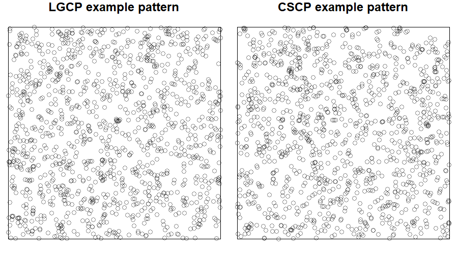
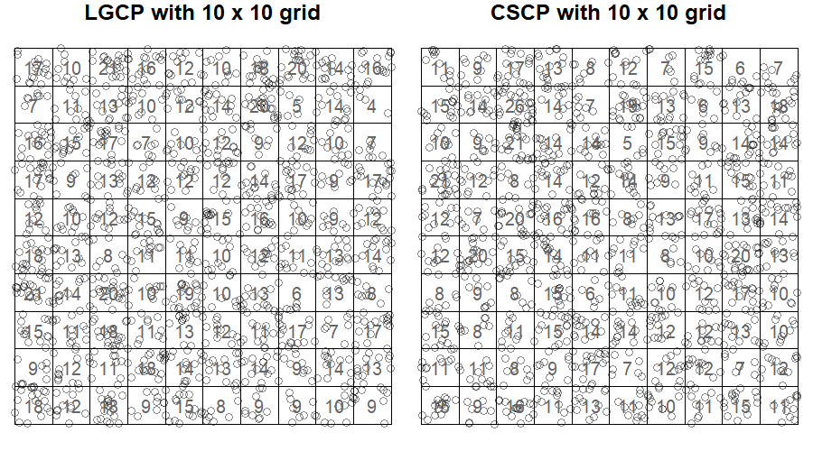
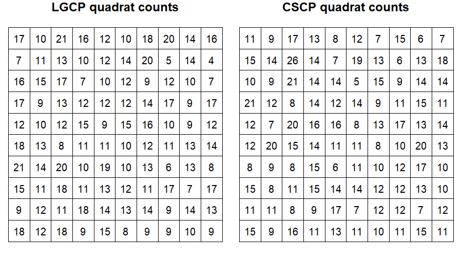
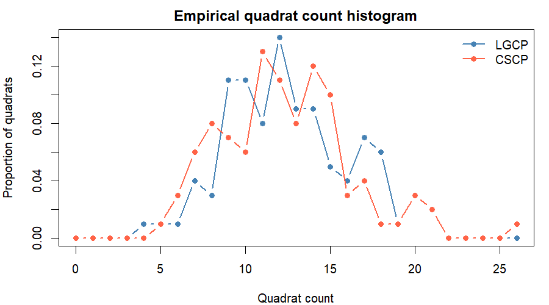

```{r include=FALSE}
library(dplyr)
library(purrr)
library(tidyr)
library(spatstat)
devtools::load_all()
```

# Quadrats

## Motivation

The previous section showed that kernel reconstruction is not an effective way to
recover the marginal differences between LGCP and CSCP models. Although the two
models have different theoretical marginal distributions for the latent
intensity field, these differences are heavily blurred once we:

1. observe only a Poisson realisation of the process,
2. reconstruct the intensity surface by kernel smoothing, and
3. treat the resulting pixel values as a proxy sample from the marginal.

This suggests that estimating the entire latent surface may be an unnecessarily
indirect route.

Instead, we now take a more direct approach based on quantities that are
observable from the point pattern itself.

## Why quadrat counts?

For a small region $B \subseteq W$, the number of observed points in $B$ satisfies

$$
N(B) \mid \Lambda \sim \text{Poisson}\left(\int_B \Lambda(u)\,du\right).
$$

Thus, a quadrat count is a direct noisy measurement of the **local average intensity** 
over that region.

This is important for two reasons.

First, quadrat counts are obtained directly from the observed point pattern,
without first reconstructing the full two-dimensional intensity surface.

Second, if LGCP and CSCP models differ in how often the latent intensity is very
small or very large, then these differences may also appear in the distribution
of counts across small quadrats. In other words, quadrat counts do not recover
the pointwise marginal distribution of $\Lambda(u)$ exactly, but may retain 
aspects of the lower-tail and upper-tail behaviour of the latent intensity 
distribution in a more directly observable form.

## Aim of this section

The goal for this section is not to estimate the marginal density of $\Lambda(u)$
itself. Rather, it is to determine whether simple summaries of quadrat counts can
capture enough of the local intensity behaviour to distinguish the two models in
practice.

If these summaries still fail to separate LGCP and CSCP models, this would
provide stronger evidence that the marginal differences, while present in
theory, are difficult to exploit from a single observed point pattern.

## Constructing empirical summaries from quadrat counts

Let $X$ be a point pattern observed in a bounded window $W \subset \mathbb{R}^2$.

Choose a rectangular grid of $m \times m$ equal-area cells $\{B_j\}_{j=1}^J$ 
(typically $J = m^2$) covering $W$ (or a bounding box for $W$).

Define cell counts 

$$
N_j = \#\{x_i\in X : x_i \in B_j\}
$$

These counts can be interpreted as noisy measurements of the local average
intensity over each quadrat.

A natural idea is therefore to treat the collection $\{N_1, \dots, N_J\}$ as a
sample from some unknown distribution reflecting local intensity behaviour, and 
to study its empirical distribution.

## Summaries considered

In particular, this section will consider the following summaries of the counts.

Primary:

1. **Histograms of quadrat counts**  
   These provide the most direct view of the empirical count distribution across
   cells. If the two models differ in how often they generate unusually small,
   moderate, or large local intensities, this should appear as differences in
   the shape of the quadrat count distribution.

2. **Index of dispersion across quadrats**  
   The index of dispersion, defined as the sample variance divided by the sample
   mean, gives a simple measure of how variable the counts are across space.
   This may reveal whether one model produces systematically more between-cell 
   variation than the other.

3. **Skewness across quadrats**  
   Skewness measures the asymmetry of the count distribution. This is useful
   because the models may differ not only in overall variability, but also in
   how strongly they generate occasional high-count cells relative to the bulk
   of the distribution.

Secondary:

4. **Proportion of zero-count quadrats**  
   This targets the lower tail of the count distribution. If one model produces
   local regions of very low intensity more frequently, this may translate into
   a higher proportion of empty cells.

5. **Maximum count among quadrats**  
   This targets the upper tail of the count distribution. If one model more
   frequently produces extreme local intensity spikes, this may be reflected in
   a larger maximum quadrat count.

## Study procedure

For fixed $(\lambda, \phi, s)$, the study proceeds as follows.

1. Match the LGCP scale parameter to the CSCP scale parameter using the
   best-matching value of $s_{\text{LGCP}}$ for the chosen $s_{\text{CSCP}}$.

2. Simulate one LGCP pattern and one CSCP pattern under the matched parameter
   setting.

3. For each chosen grid resolution, compute the quadrat counts over the window.

4. From these counts, compute the summaries listed above.

5. Repeat over many Monte Carlo replicates.

6. Compare the empirical distributions of these summaries between the two
   models.

Throughout the rest of this section, this basic procedure remains the same.
Only the parameter setting in Step 1 is varied, so that we can assess how the
degree of separation changes with $\lambda$ and $\phi$.

:::callout-note
You can see the code used [here](https://github.com/JosephReps/cscp/tree/main/notes/thesis) 
:::

```{r echo=FALSE}
# Calculate quadrat counts using spatstat's quadratcount()
# Example of splitting observation window into 2x2 grid:
#
# > get_quadrat_counts(X_lgcp, 2)
# [1] 32 21 15 28
get_quadrat_counts <- function(X, nx, ny = nx) {
  qc <- quadratcount(X, nx = nx, ny = ny)
  as.numeric(qc)
}

# Calculate sample skewness summary
# Making sure to return NA in the case that all counts 
#       are the same (sample variance = 0)
safe_skewness <- function(x) {
  x <- as.numeric(x)
  if (length(x) < 2) stop("Require at least 2 quadrats")
  
  s2 <- stats::var(x)
  if (!is.finite(s2) || s2 <= 0) return(NA_real_)
  
  # Third moment calculation
  # m3 = mean((N_j - mean(N))^3)
  m3 <- mean((x - mean(x))^3)
  
  # Return standardised skewness
  # gamma1 = m3 / s^3 (s sample SD)
  m3 / (sqrt(s2)^3)
}


# Saves the counts vector from above as a dataframe, with extra sim-info 
# Example with counts = [1] 32 21 15 28:
#
# > count_hist_df(test, "lgcp", 1, 2)
# # A tibble: 4 × 6
#   model   rep    nx    ny     k  freq
#   <chr> <dbl> <dbl> <dbl> <int> <dbl>
# 1 lgcp      1     2     2    15     1
# 2 lgcp      1     2     2    21     1
# 3 lgcp      1     2     2    28     1
# 4 lgcp      1     2     2    32     1
count_hist_df <- function(counts, model, rep, nx, ny = nx) {
  # Tabulating to store more compactly
  # Helps in the case we are using very fine grid resolution
  tab <- table(counts)
  
  tibble(
    model = model, # "LGCP" or "CSCP"
    rep = rep, # replicate number
    nx = nx, # grid resolution
    ny = ny, # grid resolution
    k = as.integer(names(tab)), # The unique count values
    freq = as.numeric(tab) # How many quadrats had each of the above count values
  )
}

# Same as above, but instead of saving the raw counts, it saves the moment info
count_moment_df <- function(counts, model, rep, nx, ny = nx) {
  # Average of the quadrat counts
  mean_count <- mean(counts)
  # Variance of the quadrat counts
  var_count  <- stats::var(counts)
  # IoD of the quadrat counts (sample variance over sample mean)
  index_dispersion_count <- if (mean_count > 0) var_count / mean_count else NA_real_
  # Skewness of the quadrat counts (see function)
  skew_count <- safe_skewness(counts)
  
  tibble(
    model = model, # "LGCP" or "CSCP"
    rep = rep, # replicate number
    nx = nx, # grid resolution
    ny = ny, # grid resolution
    mean_count = mean_count, # Average count across all quadrats
    var_count = var_count, # Variance of counts across all quadrats
    index_dispersion = index_dispersion_count, # IoD of counts across all quadrats, 
    skewness = safe_skewness(counts), # Skewness of counts across all quadrats
    prop_zero = mean(counts == 0), # Proportion of 0-count quadrats
    max_count = max(counts) # Maximum count across all quadrats
  )
}
```

```{r echo=FALSE}
#| code-fold: true
#| 
run_quadrat_count_study <- function(
    W, # Observation window
    lambda, 
    phi,
    s_cscp = 0.05, # LGCP scale will be best-matching
    grids = c(4, 8, 16, 32),
    n_sims = 200,
    seed = NULL
) {
  if (!is.null(seed)) set.seed(seed)
  
  # Match LGCP scale to CSCP scale
  s_lgcp <- match_lgcp_scale(phi = phi, s_cscp = s_cscp)
  
  # Objects for storing histograms and moments
  hist_list <- vector("list", length = 2 * n_sims * length(grids))
  moment_list <- vector("list", length = 2 * n_sims * length(grids))
  
  # Index is just for keeping calculated counts and summaries together
  idx <- 1
  
  # Study loop
  for (rep in seq_len(n_sims)) {
    # Simulate one LGCP pattern
    X_lgcp <- sim_lgcp(
      W = W,
      lambda = lambda,
      phi = phi,
      s = s_lgcp
    )$pp
    
    # Simulate one CSCP pattern
    X_cscp <- sim_cscp(
      W = W,
      lambda = lambda,
      phi = phi,
      s = s_cscp,
      df = 1
    )$pp
    
    # For each grid size
    for (m in grids) {
      # Calculate the counts per grid-tile
      counts_lgcp <- get_quadrat_counts(X_lgcp, nx = m, ny = m)
      counts_cscp <- get_quadrat_counts(X_cscp, nx = m, ny = m)
      
      # Keep track of the counts data plus summaries for each process
      hist_list[[idx]] <- count_hist_df(counts_lgcp, model = "LGCP", rep = rep, nx = m)
      moment_list[[idx]] <- count_moment_df(counts_lgcp, model = "LGCP", rep = rep, nx = m)
      idx <- idx + 1
      
      hist_list[[idx]] <- count_hist_df(counts_cscp, model = "CSCP", rep = rep, nx = m)
      moment_list[[idx]] <- count_moment_df(counts_cscp, model = "CSCP", rep = rep, nx = m)
      idx <- idx + 1
    }
  }
  
  # Combine all the data
  hist_df <- bind_rows(hist_list)
  moment_df <- bind_rows(moment_list)
  
  # Complete missing count values so summaries are comparable
  # For example if LGCP has counts up to 100 but CSCP only to 50
  # Then the below code sets all of CSCP counts from 51 to 100 = 0
  hist_df <- hist_df %>%
    group_by(nx, ny) %>%
    tidyr::complete(model, rep, k = 0:max(k), fill = list(freq = 0)) %>%
    ungroup()
  
  # Calculate proportion of each count within each replicate/grid
  hist_df <- hist_df %>%
    group_by(model, rep, nx, ny) %>%
    mutate(prop = freq / sum(freq)) %>%
    ungroup()
  
  # Histogram envelopes across simulations
  hist_summary <- hist_df %>%
    group_by(model, nx, ny, k) %>%
    summarise(
      mean_prop = mean(prop),
      med_prop = median(prop),
      lo_prop = quantile(prop, 0.025),
      hi_prop = quantile(prop, 0.975),
      .groups = "drop"
    )
  
  # Moment summaries across simulations
  moment_summary <- moment_df %>%
    group_by(model, nx, ny) %>%
    summarise(
      mean_index_dispersion = mean(index_dispersion, na.rm = TRUE),
      lo_index_dispersion = quantile(index_dispersion, 0.025, na.rm = TRUE),
      hi_index_dispersion = quantile(index_dispersion, 0.975, na.rm = TRUE),
      
      mean_skewness = mean(skewness, na.rm = TRUE),
      lo_skewness = quantile(skewness, 0.025, na.rm = TRUE),
      hi_skewness = quantile(skewness, 0.975, na.rm = TRUE),
      
      mean_prop_zero = mean(prop_zero, na.rm = TRUE),
      lo_prop_zero = quantile(prop_zero, 0.025, na.rm = TRUE),
      hi_prop_zero = quantile(prop_zero, 0.975, na.rm = TRUE),

      mean_max_count = mean(max_count, na.rm = TRUE),
      lo_max_count = quantile(max_count, 0.025, na.rm = TRUE),
      hi_max_count = quantile(max_count, 0.975, na.rm = TRUE),
      
      .groups = "drop"
    )
  
  list(
    hist_df = hist_df,
    hist_summary = hist_summary,
    moment_df = moment_df,
    moment_summary = moment_summary,
    settings = list(
      lambda = lambda,
      phi = phi,
      s_cscp = s_cscp,
      s_lgcp = s_lgcp,
      grids = grids,
      n_sims = n_sims
    )
  )
}
```

**Example of the procedure**

```{r echo=FALSE, include=FALSE}
example_lambda <- 50
example_phi <- 1
example_s_cscp <- 0.05
example_s_lgcp <- match_lgcp_scale(phi = example_phi, s_cscp = example_s_cscp)

W <- owin(c(0, 5), c(0, 5))
set.seed(1)

ex_lgcp <- sim_lgcp(
  W = W,
  lambda = example_lambda,
  phi = example_phi,
  s = example_s_lgcp
)$pp

ex_cscp <- sim_cscp(
  W = W,
  lambda = example_lambda,
  phi = example_phi,
  s = example_s_cscp,
  df = 1
)$pp

m <- 10
qc_lgcp <- quadratcount(ex_lgcp, nx = m, ny = m)
qc_cscp <- quadratcount(ex_cscp, nx = m, ny = m)

dir.create("thesis/example-carousel", showWarnings = FALSE)

# 1. Raw patterns
png("thesis/example-carousel/example1.png", width = 900, height = 500, res = 120)
par(mfrow = c(1, 2), mar = c(0, 0, 1, 0))
plot(ex_lgcp, main = "LGCP example pattern")
plot(ex_cscp, main = "CSCP example pattern")
dev.off()

# 2. Patterns with grid
png("thesis/example-carousel/example2.png", width = 900, height = 500, res = 120)
par(mfrow = c(1, 2), mar = c(0, 0, 1, 0))
plot(ex_lgcp, main = "LGCP with 10 x 10 grid")
plot(quadratcount(ex_lgcp, nx = m, ny = m), add = TRUE, col = "grey40")
plot(ex_cscp, main = "CSCP with 10 x 10 grid")
plot(quadratcount(ex_cscp, nx = m, ny = m), add = TRUE, col = "grey40")
dev.off()

# 3. Quadrat counts only
png("thesis/example-carousel/example3.png", width = 900, height = 500, res = 120)
par(mfrow = c(1, 2), mar = c(0, 0, 1, 0))
plot(qc_lgcp, main = "LGCP quadrat counts")
plot(qc_cscp, main = "CSCP quadrat counts")
dev.off()

# 4. Histogram
counts_lgcp <- as.numeric(qc_lgcp)
counts_cscp <- as.numeric(qc_cscp)

k_vals <- 0:max(c(counts_lgcp, counts_cscp))
tab_lgcp <- table(factor(counts_lgcp, levels = k_vals))
tab_cscp <- table(factor(counts_cscp, levels = k_vals))

prop_lgcp <- as.numeric(tab_lgcp) / sum(tab_lgcp)
prop_cscp <- as.numeric(tab_cscp) / sum(tab_cscp)

y_max <- max(prop_lgcp, prop_cscp)

png("thesis/example-carousel/example4.png", width = 900, height = 500, res = 120)
par(mfrow = c(1, 1), mar = c(4, 4, 2, 1))
plot(
  k_vals, prop_lgcp,
  type = "b", pch = 16, lwd = 2, col = "steelblue",
  ylim = c(0, y_max),
  xlab = "Quadrat count",
  ylab = "Proportion of quadrats",
  main = "Empirical quadrat count histogram"
)
lines(k_vals, prop_cscp, type = "b", pch = 16, lwd = 2, col = "tomato")
legend(
  "topright",
  legend = c("LGCP", "CSCP"),
  col = c("steelblue", "tomato"),
  lwd = 2,
  pch = 16,
  bty = "n"
)
dev.off()
```

::: {.example-carousel-wrap}
<button class="example-carousel-btn" onclick="moveExampleSlide(-1)">&#10094;</button>
  
::: {.example-carousel}




:::
  
<button class="example-carousel-btn" onclick="moveExampleSlide(1)">&#10095;</button>
:::

<script>
let exampleSlideIndex = 0;

function showExampleSlide(index) {
  const slides = document.querySelectorAll(".example-slide");

  if (index >= slides.length) exampleSlideIndex = 0;
  if (index < 0) exampleSlideIndex = slides.length - 1;

  slides.forEach((slide) => slide.classList.remove("active"));
  slides[exampleSlideIndex].classList.add("active");
}

function moveExampleSlide(step) {
  exampleSlideIndex += step;
  showExampleSlide(exampleSlideIndex);
}

showExampleSlide(exampleSlideIndex);
</script>

## Initial investigation

We begin by investigating whether quadrat summaries reveal any systematic
differences between the LGCP and CSCP.

As per the description above, we will be running the study with the following 
settings to begin:

- $\lambda = 200$

- $\phi = 1$

- $s_{\text{CSCP}} = 0.05$ (best-matching LGCP has $s_{\text{LGCP}} = 0.0312$)

- $n_\text{sims} = 200$ 

- Grid sizes of $\{10, 20, 30\}$ 

- $W = [0, 5] \times [0, 5]$

**Running the study:**

```{r cache=TRUE}
W <- spatstat.geom::owin(c(0, 5), c(0, 5))

quad_study <- run_quadrat_count_study(
  W = W,
  lambda = 200,
  phi = 1,
  s_cscp = 0.05,
  grids = c(20, 30, 40),
  n_sims = 200,
  seed = 123
)
```

```{r include=FALSE}
plot_quadrat_histograms <- function(study, max_k = NULL) {
  hist_sum <- study$hist_summary
  grids <- sort(unique(hist_sum$nx))
  
  if (is.null(max_k)) {
    max_k_by_grid <- sapply(grids, function(g) {
      sub <- hist_sum[hist_sum$nx == g, ]
      keep <- with(sub, hi_prop > 0.002 | mean_prop > 0.001)
      if (!any(keep)) max(sub$k) else max(sub$k[keep])
    })
  } else {
    max_k_by_grid <- rep(max_k, length(grids))
  }
  
  global_ymax <- max(
    hist_sum$hi_prop[hist_sum$k <= max(max_k_by_grid)],
    na.rm = TRUE
  )
  
  op <- par(
    mfrow = c(1, length(grids)),
    mar = c(3, 1, 2, 0.5),   # inner margins (tight!)
    oma = c(3, 4, 0, 0)      # outer margins (for shared axes)
  )
  
  for (i in seq_along(grids)) {
    g <- grids[i]
    sub <- hist_sum[hist_sum$nx == g & hist_sum$k <= max_k_by_grid[i], ]
    
    lgcp <- sub[sub$model == "LGCP", ]
    cscp <- sub[sub$model == "CSCP", ]
    
    plot(
      range(sub$k), c(0, global_ymax),
      type = "n",
      axes = FALSE,
      xlab = "",
      ylab = "",
      main = paste(g, "x", g)
    )
    
    polygon(
      c(cscp$k, rev(cscp$k)),
      c(cscp$lo_prop, rev(cscp$hi_prop)),
      border = NA,
      col = adjustcolor("tomato", alpha.f = 0.2)
    )
    
    polygon(
      c(lgcp$k, rev(lgcp$k)),
      c(lgcp$lo_prop, rev(lgcp$hi_prop)),
      border = NA,
      col = adjustcolor("steelblue", alpha.f = 0.2)
    )
    
    lines(cscp$k, cscp$mean_prop, lwd = 2, col = "tomato")
    lines(lgcp$k, lgcp$mean_prop, lwd = 2, col = "steelblue")
    
    axis(1)  # x-axis for all
    
    if (i == 1) {
      axis(2)
    }
    
    box()
    
    if (i == length(grids)) {
      legend(
        "topright",
        legend = c("LGCP", "CSCP"),
        col = c("steelblue", "tomato"),
        lwd = 2,
        bty = "n",
        cex = 1
      )
    }
  }
  
  mtext("Cell count", side = 1, outer = TRUE, line = 2)
  mtext("Proportion of cells", side = 2, outer = TRUE, line = 2.5)
  
  par(op)
}


plot_quadrat_moments <- function(study) {
  ms <- study$moment_summary
  grids <- sort(unique(ms$nx))
  
  lgcp <- ms[ms$model == "LGCP", ]
  cscp <- ms[ms$model == "CSCP", ]
  
  op <- par(mfrow = c(1, 2), mar = c(4, 4, 3, 1))
  
  # ----------------------------------------------------------
  # Index of dispersion
  # ----------------------------------------------------------
  y1 <- range(
    lgcp$lo_index_dispersion, lgcp$hi_index_dispersion,
    cscp$lo_index_dispersion, cscp$hi_index_dispersion,
    na.rm = TRUE
  )
  
  plot(
    grids, lgcp$mean_index_dispersion,
    type = "b", pch = 16, lwd = 2, col = "steelblue",
    ylim = y1,
    xlab = "Grid size m",
    ylab = "Index of dispersion",
    main = "Index of dispersion"
  )
  
  arrows(
    grids, lgcp$lo_index_dispersion,
    grids, lgcp$hi_index_dispersion,
    angle = 90, code = 3, length = 0.05,
    col = "steelblue"
  )
  
  lines(grids, cscp$mean_index_dispersion, type = "b", pch = 16, lwd = 2, col = "tomato")
  arrows(
    grids, cscp$lo_index_dispersion,
    grids, cscp$hi_index_dispersion,
    angle = 90, code = 3, length = 0.05,
    col = "tomato"
  )
  
  legend(
    "topright",
    legend = c("LGCP", "CSCP"),
    col = c("steelblue", "tomato"),
    lwd = 2,
    pch = 16,
    bty = "n"
  )
  
  # ----------------------------------------------------------
  # Skewness
  # ----------------------------------------------------------
  y2 <- range(
    lgcp$lo_skewness, lgcp$hi_skewness,
    cscp$lo_skewness, cscp$hi_skewness,
    na.rm = TRUE
  )
  
  plot(
    grids, lgcp$mean_skewness,
    type = "b", pch = 16, lwd = 2, col = "steelblue",
    ylim = y2,
    xlab = "Grid size m",
    ylab = "Skewness",
    main = "Skewness"
  )
  
  arrows(
    grids, lgcp$lo_skewness,
    grids, lgcp$hi_skewness,
    angle = 90, code = 3, length = 0.05,
    col = "steelblue"
  )
  
  lines(grids, cscp$mean_skewness, type = "b", pch = 16, lwd = 2, col = "tomato")
  arrows(
    grids, cscp$lo_skewness,
    grids, cscp$hi_skewness,
    angle = 90, code = 3, length = 0.05,
    col = "tomato"
  )
  
  legend(
    "topright",
    legend = c("LGCP", "CSCP"),
    col = c("steelblue", "tomato"),
    lwd = 2,
    pch = 16,
    bty = "n"
  )
  
  par(op)
}

plot_quadrat_secondary <- function(study) {
  ms <- study$moment_summary
  grids <- sort(unique(ms$nx))

  lgcp <- ms[ms$model == "LGCP", ]
  cscp <- ms[ms$model == "CSCP", ]

  op <- par(mfrow = c(1, 2), mar = c(4, 4, 3, 1))

  # ----------------------------------------------------------
  # Proportion of zero-count quadrats
  # ----------------------------------------------------------
  y1 <- range(
    lgcp$lo_prop_zero, lgcp$hi_prop_zero,
    cscp$lo_prop_zero, cscp$hi_prop_zero,
    na.rm = TRUE
  )

  plot(
    grids, lgcp$mean_prop_zero,
    type = "b", pch = 16, lwd = 2, col = "steelblue",
    ylim = y1,
    xlab = "Grid size m",
    ylab = "Proportion of zero-count quadrats",
    main = "Proportion of zero-count quadrats"
  )

  arrows(
    grids, lgcp$lo_prop_zero,
    grids, lgcp$hi_prop_zero,
    angle = 90, code = 3, length = 0.05,
    col = "steelblue"
  )

  lines(grids, cscp$mean_prop_zero, type = "b", pch = 16, lwd = 2, col = "tomato")
  arrows(
    grids, cscp$lo_prop_zero,
    grids, cscp$hi_prop_zero,
    angle = 90, code = 3, length = 0.05,
    col = "tomato"
  )

  legend(
    "topleft",
    legend = c("LGCP", "CSCP"),
    col = c("steelblue", "tomato"),
    lwd = 2,
    pch = 16,
    bty = "n"
  )

  # ----------------------------------------------------------
  # Maximum quadrat count
  # ----------------------------------------------------------
  y2 <- range(
    lgcp$lo_max_count, lgcp$hi_max_count,
    cscp$lo_max_count, cscp$hi_max_count,
    na.rm = TRUE
  )

  plot(
    grids, lgcp$mean_max_count,
    type = "b", pch = 16, lwd = 2, col = "steelblue",
    ylim = y2,
    xlab = "Grid size m",
    ylab = "Maximum quadrat count",
    main = "Maximum quadrat count"
  )

  arrows(
    grids, lgcp$lo_max_count,
    grids, lgcp$hi_max_count,
    angle = 90, code = 3, length = 0.05,
    col = "steelblue"
  )

  lines(grids, cscp$mean_max_count, type = "b", pch = 16, lwd = 2, col = "tomato")
  arrows(
    grids, cscp$lo_max_count,
    grids, cscp$hi_max_count,
    angle = 90, code = 3, length = 0.05,
    col = "tomato"
  )

  legend(
    "topright",
    legend = c("LGCP", "CSCP"),
    col = c("steelblue", "tomato"),
    lwd = 2,
    pch = 16,
    bty = "n"
  )

  par(op)
}
```

Below we plot the mean proportion of cells for each cell count, along side the
central 95% quantile envelopes.

```{r echo=FALSE}
# Histogram-style diagnostic
plot_quadrat_histograms(quad_study)
# plot_quadrat_histograms(quad_study, max_k = 500)
```

Observations:

- As expected, the range of observed quadrat counts decreases as the grid is
  made finer. With smaller cells, each quadrat contains fewer points on average,
  so the count distribution shifts toward smaller values.

- Across all three grid sizes, the two mean histograms are very similar, but the
  CSCP tends to place slightly more mass on a narrower band of moderate counts,
  while the LGCP appears slightly more spread out.

- These differences are visible, but modest. The histogram comparison suggests
  that quadrat counts do retain some information about the underlying model.

```{r echo=FALSE}
# Dispersion + skewness diagnostic
plot_quadrat_moments(quad_study)
```

Observations:

- The mean index of dispersion is consistently slightly lower for the CSCP than
  for the LGCP across all three grid sizes. This suggests that, at this setting,
  LGCP quadrat counts are marginally more variable across cells.

- The mean skewness is consistently slightly higher for the CSCP than for the
  LGCP. This suggests that the CSCP count distribution is somewhat more
  asymmetric, even though its overall dispersion is slightly smaller.

- In both cases, however, the Monte Carlo envelopes overlap heavily. So while
  these summaries show a consistent directional difference, the effect size is
  small relative to simulation-to-simulation variability.
  
Looking at the max counts, and proportion of zero counts:

```{r echo=FALSE, warning=FALSE}
plot_quadrat_secondary(quad_study)
```

Observations:

- The proportion of zero-count quadrats is almost identical between the two
  models at all three grid sizes. In particular, both models produce essentially
  no empty cells on the $20 \times 20$ grid, and then show very similar
  increases in zero-count cells as the grid is refined.

- The mean maximum quadrat count is also extremely similar between the two
  models. At each grid size, the CSCP is only very slightly larger on average,
  but the difference is negligible relative to the overall scale of the maxima.

- Taken together, these two tail-focused summaries do not appear to provide any
  practically useful separation here. Both the lower-tail behaviour (via the
  proportion of zeros) and the upper-tail behaviour (via the maximum count) are
  almost indistinguishable once viewed through quadrat counts.

### Comments on the initial investigation

Overall, these initial results suggest that quadrat counts do preserve a small
amount of model-specific information. In particular, the histogram, index of
dispersion, and skewness all show weak but directionally consistent differences
between the LGCP and CSCP at this parameter setting.

However, the separation is modest, and the overlap across Monte Carlo replicates
is substantial. The secondary summaries are even less encouraging: the
proportion of zero-count quadrats and the maximum quadrat count are almost
identical between the two models.

Thus, the main conclusion from this initial investigation is that quadrat-based
summaries may contain some signal, but that signal is weak. This motivates
examining whether the strength and direction of the separation changes more
systematically as $\lambda$ and $\phi$ vary.

## Varying lambda

We now investigate how the separation between the two models changes as the mean
intensity $\lambda$ varies, while holding $\phi$ and $s_{\text{CSCP}}$ fixed.
This is important because quadrat counts are affected not only by the latent
intensity model, but also by the overall number of observed points. At low
values of $\lambda$, quadrat counts are sparse and noisy, whereas at higher
values the counts may more faithfully reflect differences in the underlying
random intensity field.

Throughout this section, we fix

- $\phi = 1$
- $s_{\text{CSCP}} = 0.05$
- $W = [0,5]\times[0,5]$
- Grid sizes $\{20,30,40\}$

```{r include=FALSE, cache=TRUE}
run_quadrat_lambda_scan <- function(
    W,
    lambda_vals,
    phi = 1,
    s_cscp = 0.05,
    grids = c(20, 30, 40),
    n_sims = 100,
    seed = NULL
) {
  if (!is.null(seed)) set.seed(seed)

  out <- purrr::map_dfr(seq_along(lambda_vals), function(i) {
    lambda_i <- lambda_vals[i]

    study_i <- run_quadrat_count_study(
      W = W,
      lambda = lambda_i,
      phi = phi,
      s_cscp = s_cscp,
      grids = grids,
      n_sims = n_sims,
      seed = if (is.null(seed)) NULL else seed + i - 1
    )

    study_i$moment_df %>%
      mutate(lambda = lambda_i) %>%
      group_by(lambda, model, nx, ny) %>%
      mutate(rep_id = row_number()) %>%
      ungroup()
  })

  out %>%
    select(lambda, rep_id, model, nx, ny, index_dispersion, skewness) %>%
    tidyr::pivot_wider(
      names_from = model,
      values_from = c(index_dispersion, skewness)
    ) %>%
    mutate(
      diff_dispersion = index_dispersion_LGCP - index_dispersion_CSCP,
      diff_skewness   = skewness_CSCP - skewness_LGCP
    ) %>%
    group_by(lambda, nx, ny) %>%
    summarise(
      mean_diff_dispersion = mean(diff_dispersion, na.rm = TRUE),
      lo_diff_dispersion   = quantile(diff_dispersion, 0.025, na.rm = TRUE),
      hi_diff_dispersion   = quantile(diff_dispersion, 0.975, na.rm = TRUE),

      mean_diff_skewness = mean(diff_skewness, na.rm = TRUE),
      lo_diff_skewness   = quantile(diff_skewness, 0.025, na.rm = TRUE),
      hi_diff_skewness   = quantile(diff_skewness, 0.975, na.rm = TRUE),

      .groups = "drop"
    ) %>%
    arrange(nx, lambda)
}


plot_lambda_scan <- function(lambda_scan) {
  grids <- sort(unique(lambda_scan$nx))
  cols <- c("steelblue", "tomato", "darkgreen")
  cols <- cols[seq_along(grids)]

  op <- par(mfrow = c(1, 2), mar = c(4, 4, 3, 1))

  # ----------------------------------------------------------
  # Dispersion difference
  # ----------------------------------------------------------
  y1 <- range(
    lambda_scan$lo_diff_dispersion,
    lambda_scan$hi_diff_dispersion,
    na.rm = TRUE
  )

  plot(
    range(lambda_scan$lambda), y1,
    type = "n",
    xlab = expression(lambda),
    ylab = "LGCP - CSCP index of dispersion",
    main = "Dispersion separation across lambda"
  )
  abline(h = 0, lty = 2)

  for (i in seq_along(grids)) {
    g <- grids[i]
    sub <- lambda_scan[lambda_scan$nx == g, ]

    polygon(
      c(sub$lambda, rev(sub$lambda)),
      c(sub$lo_diff_dispersion, rev(sub$hi_diff_dispersion)),
      border = NA,
      col = adjustcolor(cols[i], alpha.f = 0.15)
    )

    lines(
      sub$lambda, sub$mean_diff_dispersion,
      type = "b", pch = 16, lwd = 2, col = cols[i]
    )
  }

  legend(
    "topleft",
    legend = paste("Grid", grids),
    col = cols,
    lwd = 2,
    pch = 16,
    bty = "n"
  )

  # ----------------------------------------------------------
  # Skewness difference
  # ----------------------------------------------------------
  y2 <- range(
    lambda_scan$lo_diff_skewness,
    lambda_scan$hi_diff_skewness,
    na.rm = TRUE
  )

  plot(
    range(lambda_scan$lambda), y2,
    type = "n",
    xlab = expression(lambda),
    ylab = "CSCP - LGCP skewness",
    main = "Skewness separation across lambda"
  )
  abline(h = 0, lty = 2)

  for (i in seq_along(grids)) {
    g <- grids[i]
    sub <- lambda_scan[lambda_scan$nx == g, ]

    polygon(
      c(sub$lambda, rev(sub$lambda)),
      c(sub$lo_diff_skewness, rev(sub$hi_diff_skewness)),
      border = NA,
      col = adjustcolor(cols[i], alpha.f = 0.15)
    )

    lines(
      sub$lambda, sub$mean_diff_skewness,
      type = "b", pch = 16, lwd = 2, col = cols[i]
    )
  }

  legend(
    "topleft",
    legend = paste("Grid", grids),
    col = cols,
    lwd = 2,
    pch = 16,
    bty = "n"
  )

  par(op)
}


W <- spatstat.geom::owin(c(0, 5), c(0, 5))

lambda_scan <- run_quadrat_lambda_scan(
  W = W,
  lambda_vals = c(100, 200, 500, 1000, 2000),
  phi = 1,
  s_cscp = 0.05,
  grids = c(20, 30, 40),
  n_sims = 200,
  seed = 123
)
```

For each value of $\lambda$, we compute the quadrat summaries over many Monte
Carlo replicates, then examine the mean difference between the two models,
together with central 95% Monte Carlo bands.

```{r echo=FALSE}
plot_lambda_scan(lambda_scan)
```

Observations:

- For both summaries, the direction of the difference is broadly consistent
  with the initial investigation. The LGCP tends to have a slightly larger
  index of dispersion, while the CSCP tends to have a slightly larger skewness.

- The magnitude of the difference generally increases with $\lambda$ for both
  summaries. This effect is most pronounced for the index of dispersion on the
  coarser grids (e.g. $20 \times 20$), where the mean difference grows from
  near zero at $\lambda = 100$ to around $0.8$ at $\lambda = 2000$.

- This pattern is consistent with the idea that larger values of $\lambda$
  reduce sampling noise in the quadrat counts, allowing underlying differences
  in the latent intensity field to become more visible.

- However, the strength of this increase depends strongly on the grid
  resolution. For finer grids (e.g. $40 \times 40$), the separation remains
  much weaker, even at large values of $\lambda$.

- Most importantly, the 95% Monte Carlo intervals for both summaries overlap
  zero across all values of $\lambda$ and all grid sizes. In many cases, the
  intervals are wide relative to the mean difference, particularly at larger
  $\lambda$, where variability in extreme counts increases.

Overall, while increasing $\lambda$ leads to some strengthening of the
differences between the models, these differences remain small relative to
Monte Carlo variability.

### Comments

TBA 

```{r echo=FALSE}
# lambda_scan %>%
#   select(lambda, nx,
#          mean_diff_dispersion, lo_diff_dispersion, hi_diff_dispersion,
#          mean_diff_skewness, lo_diff_skewness, hi_diff_skewness) %>%
#   arrange(nx, lambda)
```

## Varying phi

```{r echo=FALSE, cache=TRUE}
## Varying phi

run_quadrat_phi_scan <- function(
    W,
    phi_vals,
    lambda = 1000,
    s_cscp = 0.05,
    grids = c(20, 30, 40),
    n_sims = 100,
    seed = NULL
) {
  if (!is.null(seed)) set.seed(seed)

  out <- purrr::map_dfr(seq_along(phi_vals), function(i) {
    phi_i <- phi_vals[i]

    study_i <- run_quadrat_count_study(
      W = W,
      lambda = lambda,
      phi = phi_i,
      s_cscp = s_cscp,
      grids = grids,
      n_sims = n_sims,
      seed = if (is.null(seed)) NULL else seed + i - 1
    )

    study_i$moment_df %>%
      mutate(phi = phi_i) %>%
      group_by(phi, model, nx, ny) %>%
      mutate(rep_id = row_number()) %>%
      ungroup()
  })

  out %>%
    select(phi, rep_id, model, nx, ny, index_dispersion, skewness) %>%
    tidyr::pivot_wider(
      names_from = model,
      values_from = c(index_dispersion, skewness)
    ) %>%
    mutate(
      diff_dispersion = index_dispersion_LGCP - index_dispersion_CSCP,
      diff_skewness   = skewness_CSCP - skewness_LGCP
    ) %>%
    group_by(phi, nx, ny) %>%
    summarise(
      mean_diff_dispersion = mean(diff_dispersion, na.rm = TRUE),
      lo_diff_dispersion   = quantile(diff_dispersion, 0.025, na.rm = TRUE),
      hi_diff_dispersion   = quantile(diff_dispersion, 0.975, na.rm = TRUE),

      mean_diff_skewness = mean(diff_skewness, na.rm = TRUE),
      lo_diff_skewness   = quantile(diff_skewness, 0.025, na.rm = TRUE),
      hi_diff_skewness   = quantile(diff_skewness, 0.975, na.rm = TRUE),

      .groups = "drop"
    ) %>%
    arrange(nx, phi)
}


plot_phi_scan <- function(phi_scan) {
  grids <- sort(unique(phi_scan$nx))
  cols <- c("steelblue", "tomato", "darkgreen")
  cols <- cols[seq_along(grids)]

  op <- par(mfrow = c(1, 2), mar = c(4, 4, 3, 1))

  # ----------------------------------------------------------
  # Dispersion difference
  # ----------------------------------------------------------
  y1 <- range(
    phi_scan$lo_diff_dispersion,
    phi_scan$hi_diff_dispersion,
    na.rm = TRUE
  )

  plot(
    range(phi_scan$phi), y1,
    type = "n",
    xlab = expression(phi),
    ylab = "LGCP - CSCP index of dispersion",
    main = "Dispersion separation across phi"
  )
  abline(h = 0, lty = 2)

  for (i in seq_along(grids)) {
    g <- grids[i]
    sub <- phi_scan[phi_scan$nx == g, ]

    polygon(
      c(sub$phi, rev(sub$phi)),
      c(sub$lo_diff_dispersion, rev(sub$hi_diff_dispersion)),
      border = NA,
      col = adjustcolor(cols[i], alpha.f = 0.15)
    )

    lines(
      sub$phi, sub$mean_diff_dispersion,
      type = "b", pch = 16, lwd = 2, col = cols[i]
    )
  }

  legend(
    "topleft",
    legend = paste("Grid", grids),
    col = cols,
    lwd = 2,
    pch = 16,
    bty = "n"
  )

  # ----------------------------------------------------------
  # Skewness difference
  # ----------------------------------------------------------
  y2 <- range(
    phi_scan$lo_diff_skewness,
    phi_scan$hi_diff_skewness,
    na.rm = TRUE
  )

  plot(
    range(phi_scan$phi), y2,
    type = "n",
    xlab = expression(phi),
    ylab = "CSCP - LGCP skewness",
    main = "Skewness separation across phi"
  )
  abline(h = 0, lty = 2)

  for (i in seq_along(grids)) {
    g <- grids[i]
    sub <- phi_scan[phi_scan$nx == g, ]

    polygon(
      c(sub$phi, rev(sub$phi)),
      c(sub$lo_diff_skewness, rev(sub$hi_diff_skewness)),
      border = NA,
      col = adjustcolor(cols[i], alpha.f = 0.15)
    )

    lines(
      sub$phi, sub$mean_diff_skewness,
      type = "b", pch = 16, lwd = 2, col = cols[i]
    )
  }

  legend(
    "topright",
    legend = paste("Grid", grids),
    col = cols,
    lwd = 2,
    pch = 16,
    bty = "n"
  )

  par(op)
}


W <- spatstat.geom::owin(c(0, 5), c(0, 5))

phi_scan <- run_quadrat_phi_scan(
  W = W,
  phi_vals = c(0.5, 1, 1.5, 2),
  lambda = 200,
  s_cscp = 0.05,
  grids = c(20, 30, 40),
  n_sims = 200,
  seed = 123
)
```

```{r echo=FALSE}
plot_phi_scan(phi_scan)
```

```{r echo=FALSE}
# phi_scan %>%
#   select(phi, nx,
#          mean_diff_dispersion, lo_diff_dispersion, hi_diff_dispersion,
#          mean_diff_skewness, lo_diff_skewness, hi_diff_skewness) %>%
#   arrange(nx, phi)
```

## Comments

## Conclusion?

## Bonus: How large do we need lambda, to confidently distinguish?

```{r cache=TRUE}
W <- spatstat.geom::owin(c(0, 5), c(0, 5))

lambda_scan <- run_quadrat_lambda_scan(
  W = W,
  lambda_vals = c(2000, 4000, 6000),
  phi = 2,
  s_cscp = 0.05,
  grids = c(40, 50, 60),
  n_sims = 100,
  seed = 123
)
```

```{r}
plot_lambda_scan(lambda_scan)
```


